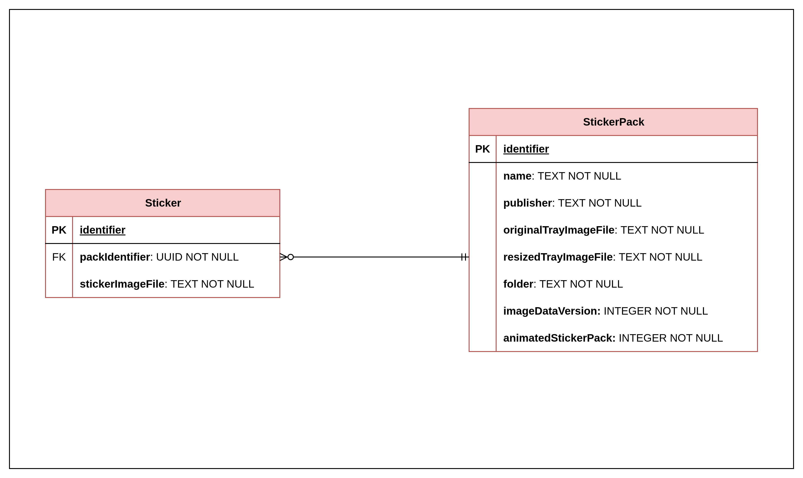

# Best Sticker App  

O Best Sticker App é um aplicativo que cria pacotes e figurinhas para serem utilizadas no WhatsApp.

## Como baixar e instalar

## Overview 
### Motivação

Eu adoro as figurinhas do WhatsApp, sempre que termino uma frase mando uma figurinha. Decidi fazer este aplicativo porque, mesmo que compreensível, os aplicativos que já vi contêm muitas propagandas. Muitas vezes só quero adicionar **uma** figurinha e eu preciso assistir uma propaganda de 30 segundos :/

### Base utilizada

Fiquei curioso sobre como o mundo das figurinhas poderia funcionar por de trás dos panos, procurei alguma documentação
ou coisa do tipo e achei um projeto do próprio WhatsApp com um exemplo de aplicativo de
figurinhas: https://github.com/WhatsApp/stickers

Utilizei o projeto do WhatsApp como base, construí a minha versão em cima do código do aplicativo de exemplo. Isso foi
importante e necessário para eu aprender Android e também entender os passos necessários para passar os dados dos
pacotes de figurinhas e das figurinhas em si para o WhatsApp.

**Observação**: vou alternar o nome WhatsApp com o nome "Whats".

## Componentes do projeto

O Best Sticker App usa algumas tecnologias para funcionar. Vou listá-las aqui e explicarei futuramente neste readme.

#### Aplicativo

- Java 17;
- Android;
- Gradle;
- SQLite;
- Testes: JUnit, Mockito e Robolectric;
- Dependências importantes: OkHttp (chamadas HTTP), Gson (conversão de JSON para objeto java) e Plugin Farebase (para monitoramento);

#### Serviços fora do aplicativo

Para o aplicativo funcionar completamente, existem alguns serviços feitos por mim que ajudam o aplicativo a funcionar.
Todos eles são funções Lambda AWS que estão disponíveis no mesmo API Gateway (AWS) :

- **StickerImageConverter**: Recebe uma imagem em Base64 e converte ela para o formato WEBP, formato que o WhatsApp
  demanda que as figurinhas estejam. Não consegui implementar um conversor dentro do aplicativo, então separei a funcionalidade do aplicativo e a disponibilizei via WebService;
- **StickerExceptionReceiver**: Recebe uma mensagem contendo detalhes da exception que ocorreu no aplicativo e salva em
  um Bucket S3 (AWS);
- **StickerLatestVersionText**: Retorna um json com as informações de uma atualização do aplicativo. Essa informações
  são usadas para o aplicativo mostrar as alterações ao usuário e também contém algumas informações necessárias para a
  atualização do aplicativo. As informações da versão ficam num Bucket S3 também;
- **StickerXAPIKeyAuthorizer**: Esta é a função que autentica as requisições enviadas ao API Gateway. Cada versão contém
  um token gerado no momento do build da release que é armazenado em um Bucket S3. As requisições só são válidas se
  conterem um token válido (mais detalhes serão mostrados em outro momento);

### Entidades

Presumivelmente, as únicas entidades que existem no projeto, por enquanto, são:

- Sticker:
  - identifier (UUID - PK);
  - packIdentifier (UUID - FK)
  - stickerImagefile (TEXT - Esta coluna apenas guarda o nome do arquivo e não a imagem de fato)
- StickerPack:
  - identifier (UUID - PK);
  - publisher (TEXT - Nome do autor do pacote);
  - originalTrayImageFile (TEXT - Nome do arquivo que contém uma cópia da imagem original que não teve seu tamanho alterado);
  - resizedTrayImageFile (TEXT - Nome do arquivo que contém a imagem que será utilizada como ícone do pacote pelo WhatsApp);
  - folder (TEXT - Nome da pasta que contém os arquivos do pacote de figurinhas);
  - imageDataVersion (INTEGER - Número da versão do pacote. Este número aumenta toda vez que o pacote é alterado);
  - animatedStickerPack (INTEGER - Define se o pacote contém figurinhas animadas ou estáticas, essa informação é necessária para o WhatsApp);

Observações:
- Eu utilizo UUID porque o WhatsApp identifica se um pacote/sticker já foi adicionado utilizando este campo. Já que uma pacote e/ou figurinha podem ter *n* origens, optei o UUID para impedir (ou dificultar) a repetição de IDs

### Casos de uso importantes

Alguns casos de uso como remoção de pacote de figurinha ou remoção de figurinha, exibição das figurinhas e pacotes, entre outros, não serão detalhados aqui.

#### 1. Criando um pacote

O fluxo começa na tela inicial do aplicativo. Ao clicar no botão "CRIAR NOVO PACOTE" e preencher os campos, o sistema
segue os seguintes passos:

1. Cria a pasta que conterá as imagens do pacote e os stickers em: *internal_storage_directory*/**files**/**packs**/*nome_pacote_pasta*
2. Copia as imagens:
   1. Copia a imagem original selecionada à pasta criada no passo 1 e dá o nome de "packImage" + data atual (Esse passo acontece na criação do pacote para manter a imagem original sem ter seu tamanho alterado. Ela é utilizada para preencher o ImageView ao editar o pacote);
      1. Rotaciona a imagem caso ela esteja rotacionada (celulares Samsung rotacionam as imagens tiradas pela câmera do celular);
   3. Copia a image original selecionada à pasta criada no passo 1 e dá o nome de "packImageRzd" + data atual;
      1. Modifica o tamanho da imagem para 96x96. O WhatsApp requer que a imagem do pacote tenha este tamanho.
      2. Rotaciona a imagem caso ela esteja rotacionada (celulares Samsung rotacionam as imagens tiradas pela câmera do celular);
      3. Envia a imagem para o serviço **StickerImageConverter** para converter a imagem ao formato WEBP.
3. Verifica a integridade do pacote:
   1. Verifica alguns campos do objeto instanciado *StickerPack*;
   2. Verifica se a imagem passada é um arquivo válido de imagem;
   3. Verifica altura e largura da imagem;
4. Persiste no banco de dados; 

#### 2. Criando uma figurinha

O fluxo começa na tela de detalhes do pacote. Ao clicar no botão " + " e selecionar a imagem da figurinha, o aplicativo seguee os seguintes passos:

1. Copia a imagem:
   1. Copia a image original selecionada à pasta do pacote de figurinhas e dá o nome de "sticker" + data atual:
     1. Modifica o tamanho da imagem para 512x512. O WhatsApp requer que a imagem da figurinha tenha este tamanho.
     2. Rotaciona a imagem caso ela esteja rotacionada (celulares Samsung rotacionam as imagens tiradas pela câmera do celular);
     3. Envia a imagem para o serviço **StickerImageConverter** para converter a imagem ao formato WEBP.
2. Verifica a integridade da figurinha:
   1. Verifica alguns campos do objeto instanciado *Sticker*;
   2. Verifica se a imagem passada é um arquivo válido de imagem;
   3. Verifica altura e largura da imagem;
3. Persiste no banco de dados;

#### 3. Tratamento de erro

Quando um erro ocorre no aplicativo, este envia uma notificação de erro contendo o StackTrace e algumas informações adicionais.

1. Exception capturada;
2. Mostrar um Dialog contendo uma mensagem de erro customizada;
3. Adiciona o log do erro na pasta *internal_storage_directory*/**files**/**errors**/

Quando o aplicativo inicia, uma thread é aberta para ler os arquivos da pasta *internal_storage_directory*/**files**/**errors**/ e enviar
todos para o Bucket S3

1. Aplicativo abre, thread é criada;
2. Itera por todos os arquivos da pasta de erros
   1. Lê o arquivo;
   2. Envia a RQ contendo o log;
   3. Remove o arquivo da pasta de erros;

#### 4. Atualização do aplicativo

O aplicativo não é distribuído pela Play Store. Decidi não distribuir na Play Store principalmente pela questão financeira, atualmente estou desempregado e achei melhor não gastar os 25 dólares necessários.

Como o aplicativo não é distribuído pela Play Store, o aplicativo gerencia totalmente suas atualizações. Os passos tomados por mim na atualização são:

1. Buildar o aplicativo no Github Actions;
   1. O build to script do Github Actions tem os seguintes passos principais:
      1. Decodifica a keystore utilizada para assinar o aplicativo;
      2. Gera uma key aleatória utilizada na autenticação dos serviços HTTP;
      3. Dá upload da key aleatória gerada no passo anterior no Bucket que contém as keys válidas utilizadas na autenticação;
      4. Builda o aplicativo e assina a APK com a chave decodificada no passo 1.
      5. Dá upload do APK assinado num Bucket. O arquivo é salvo em uma pasta com o nome da versão construída.
2. Alterar a notificação que aparece no aplicativo sobre a atualização. As informações da atualização ficam em outro Bucket que guarda um json contendo as informações estruturadas da atualização;

Os passos tomados pelo aplicativo são:

1. Sempre ao iniciar o aplicativo, ele envia uma requisição HTTP a função lambda que devolve a informação da versão mais recente. Se a versão mais recente for diferente da instalada no celular, um dialog é mostrado sinalizando que há uma nova atualização;
1. Caso o usuário aceite atualizar, o aplicativo mostra as informações da atualização recebidas da chamada do passo 1;
1. A atualização é baixada do Bucket S3 que a contém. A versão atualizada é baixada na pasta /storage/emulated/0/Android/data/com.best.stickerapp/files/
1. Após baixar a atualização, o usuário é redirecionado a outra activity contendo uma explicação sobre a necessidade da permissão de instalação de aplicativos desconhecidos. Esta permissão é necessária porque com ela o aplicativo consegue instalar a atualização por você. Normalmente essa requisição não é necessária porque a Play Store toma o papel de atualizar os aplicativos instalados no dispositivo.
1. Ao permitir a instalação de aplicativos desconhecidos, o usuário pode instalar a atualização e o Android cuida do resto do processo!

## Pendências do projeto

### Pendências inadiáveis

#### ~~Atualização do aplicativo~~

Implementar uma funcionalidade de atualização do aplicativo, baixando e instalando novas versões caso o usuário aceite.

### Pendências adiáveis

#### Editar imagem selecionada para pacote ou figurinha

Atualmente a imagem selecionada é achatada ou espremida para caber dentro do tamanho exigido pelo WhatsApp que é de 512x512 para figurinhas e 96x96 para a imagem do pacote. Decidi não gastar tempo com isso agora porque 99% das figurinhas que eu faço ficam mais engraçadas achatadas, porém sei que outros usuários vão se incomodar com isso.

#### Funcionalidade de compartilhar pacote de figurinhas

Acho que seria interessante esta funcionalidade. Normalmente eu compartilho as figurinhas enviando todas que eu tenho, então acho que seria algo interessante, além de ser muito bom como aprendizado.

#### Banimento por figurinha indevida

Não aceito que meu aplicativo seja usado para criação de figurinhas que promovem discurso de ódio, então vou desenvolver uma funcionalidade que usa I.A. para identificar se a figurinha contém algum tipo de símbolo de ódio ou outras coisas ruins.

#### Mudar a mensagem de atualização de pacote

O Whats coloca uma mensagem de "tal pacote já foi adicionado".
